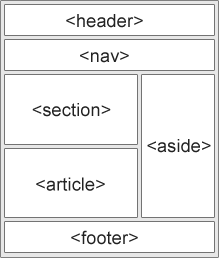

## Semantic Elements in HTML (Семантика)

  

    <ul>
      <li><code>&lt;article&gt;</code></li>
      <li><code>&lt;aside&gt;</code></li>
      <li><code>&lt;details&gt;</code></li>
      <li><code>&lt;figcaption&gt;</code></li>
      <li><code>&lt;figure&gt;</code></li>
      <li><code>&lt;footer&gt;</code></li>
      <li><code>&lt;header&gt;</code></li>
      <li><code>&lt;main&gt;</code></li>
      <li><code>&lt;mark&gt;</code></li>
      <li><code>&lt;nav&gt;</code></li>
      <li><code>&lt;section&gt;</code></li>
      <li><code>&lt;summary&gt;</code></li>
      <li><code>&lt;time&gt;</code></li>
    </ul>
  

  

    
  

## Box model (Блочная модель)
Блочная модель, она же box model — это алгоритм расчёта размеров каждого отдельного элемента на странице

Каждый элемент на веб-странице — это прямоугольник, к которому во время отрисовки браузеры применяют CSS-свойства.

Блочная модель состоит из нескольких CSS-свойств, влияющих на размеры элемента:

- `width` — ширина элемента;
- `height` — высота элемента;
- `padding` — внутренние отступы от контента до краёв элемента;
- `border` — рамка, идущая по краю элемента;
- `margin` — внешние отступы вокруг элемента.

## box-sizing
По умолчанию браузеры рассчитывают размеры элемента ровно так, как описано выше, прибавляя внутренние отступы и рамки к ширине и высоте. С этим могут быть связаны неприятные сюрпризы, когда элемент в вёрстке занимает больше места, чем вы ожидаете.

Мы можем поменять стандартное поведение и указать браузеру, что ширина и высота, заданные в CSS, должны включать в себя, в том числе, внутренние отступы и рамки.

## Значения свойства display
### block
`block` — элемент отображается как блок и занимает всю доступную ширину. Новый блок начинается с новой строки. Примером элемента, который имеет значение `display: block`, может быть `div`.

### inline
`inline` — элемент отображается как строчный элемент и не создаёт новый блок. Элемент занимает столько места, сколько ему нужно для отображения содержимого. Примером элемента, который имеет значение `display: inline`, может быть `span`.

### inline-block
`inline-block` — элемент отображается как строчный элемент, но его содержимое может быть отформатировано как блок. Элемент занимает столько места, сколько ему нужно для отображения содержимого, но может иметь ширину и высоту. Примером элемента, который имеет значение `display: inline-block`, может быть `button`.

## Разница между flex и grid
`CSS Grid` — двумерная система макета, которая работает с строками и столбцами, тогда как `Flexbox` — одномерная система макета, предназначенная для работы с строками или столбцами
